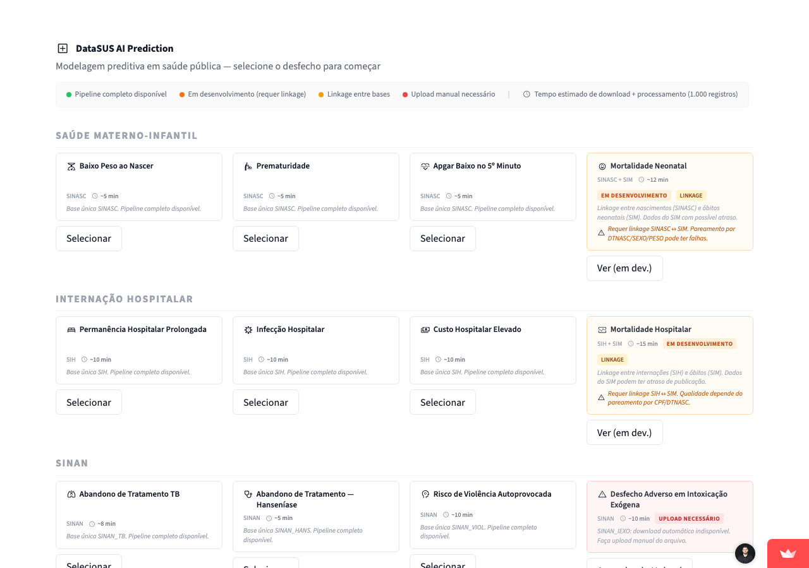

<p align="center">
  
</p>

<h1 align="center">DataSUS AI Prediction</h1>

<p align="center">
  Plataforma interativa de modelagem preditiva em saúde pública usando microdados do DataSUS — sem código, direto no navegador.
</p>

<p align="center">
  <a href="https://datasus-ai-prediction.streamlit.app"></a>
</p>

<p align="center">
  <a href="https://huggingface.co/spaces/fabianonbfilho/datasus-ai-prediction"></a>
  <a href="https://streamlit.io"></a>
  <a href="https://python.org"></a>
  <a href="LICENSE"></a>
</p>

<p align="center">
  
</p>

---

## O que e esta plataforma

DataSUS AI Prediction e uma ferramenta de pesquisa que permite a qualquer epidemiologista, residente medico ou cientista de dados:

1. Selecionar um desfecho clinico de interesse (readmissao, mortalidade, dengue grave, etc.)
2. Baixar automaticamente os microdados do DataSUS (SIH, SIM, SINASC, SINAN)
3. Construir uma coorte analítica com janelas de observacao e predicao bem definidas
4. Treinar modelos de machine learning com validacao cruzada estratificada
5. Interpretar os resultados com graficos de SHAP, curvas ROC e calibracao

Nao e necessario escrever uma linha de codigo.

---

## 17 desfechos prontos para modelar

### Internacao Hospitalar (SIH)
| Desfecho | Fonte |
|---|---|
| Readmissao Hospitalar em 30 dias | SIH |
| Mortalidade Hospitalar | SIH + SIM |
| Permanencia Hospitalar Prolongada | SIH |
| Custo Hospitalar Elevado | SIH |
| Infeccao Hospitalar | SIH |

### Nascimentos e Perinatal (SINASC)
| Desfecho | Fonte |
|---|---|
| Mortalidade Neonatal | SINASC + SIM |
| Prematuridade | SINASC |
| Baixo Peso ao Nascer | SINASC |
| Apgar Baixo no 5 Minuto | SINASC |

### Doencas Infecciosas (SINAN)
| Desfecho | Fonte |
|---|---|
| Dengue com Sinais de Alarme ou Grave | SINAN Dengue |
| Hospitalizacao por Chikungunya | SINAN Chikungunya |
| Abandono de Tratamento TB | SINAN Tuberculose |
| Abandono de Tratamento Hanseniase | SINAN Hanseniase |
| Obito por AIDS | SINAN AIDS |
| Nao-Cura de Sifilis Adquirida | SINAN Sifilis |

### Saude Mental e Violencia (SINAN)
| Desfecho | Fonte |
|---|---|
| Risco de Violencia Autoprovocada / Suicidio | SINAN Violencia |
| Desfecho Adverso em Intoxicacao Exogena | SINAN Intoxicacao |

---

## Arquitetura tecnica

```
datasus-ai-prediction/
├── app.py                        # Home Streamlit
├── pages/
│   └── 0_Analise.py              # Wizard unico de 5 etapas
├── core/
│   ├── data/
│   │   ├── downloader.py         # Download automatico: HTTP mirror > FTP > upload manual
│   │   ├── sih.py / sim.py / sinasc.py / sinan*.py   # Pre-processadores por sistema
│   │   └── linker.py             # Record linkage deterministico + probabilistico
│   ├── features/
│   │   └── cohort.py             # CohortBuilder com janelas temporais
│   ├── models/
│   │   ├── pipeline.py           # train_cv() com StratifiedKFold + Optuna HPO
│   │   └── evaluation.py        # ROC, PR, calibracao, SHAP (Plotly)
│   └── outcomes/
│       ├── base.py               # OutcomeConfig (ABC)
│       └── *.py                  # 17 desfechos implementados
```

### Stack
- **Download:** `datasus-dbc` (DBC → DBF sem compilador C) + mirror HTTP DigitalOcean + FTP DataSUS
- **ML:** LightGBM, XGBoost, Logistic Regression, Random Forest
- **Otimizacao:** Optuna (hyperparameter search automatico)
- **Explicabilidade:** SHAP values com graficos interativos
- **Validacao:** StratifiedKFold(5) + amostragem estratificada
- **Calibracao:** Platt Scaling, comparacao entre estados/periodos

---

## Como usar

### Na plataforma web

Acesse [datasus-ai-prediction.vercel.app](https://datasus-ai-prediction.vercel.app) e siga as 5 etapas:

```
1. Desfecho   → escolha o que quer prever
2. Dados      → selecione estado(s) e ano(s), download automatico
3. Coorte     → revise distribuicao, balanceamento, features
4. Modelo     → escolha algoritmo e treine com validacao cruzada
5. Resultados → curvas ROC, SHAP, calibracao, comparacao entre grupos
```

### Localmente

```bash
git clone https://github.com/fabianofilho/datasus-ai-prediction
cd datasus-ai-prediction
pip install -r requirements.txt
streamlit run app.py
```

---

## Estrategia de download de dados

O downloader tenta automaticamente em cascata:

```
1. Cache local (parquet)         → instantaneo se ja baixou antes
2. Mirror HTTP (DigitalOcean)    → rapido, sem autenticacao
3. FTP direto (ftp.datasus.gov.br) → fallback oficial
4. Upload manual (CSV)           → instrucoes do TABNET + uploader na UI
```

Funciona em Windows, Linux e Mac sem necessidade de compilador C.

---

## Sistemas de informacao suportados

| Sistema | Descricao | Cobertura |
|---|---|---|
| **SIH** | Sistema de Informacoes Hospitalares | 2008–atual, mensal por UF |
| **SIM** | Sistema de Informacoes sobre Mortalidade | 1996–atual, anual por UF |
| **SINASC** | Sistema de Informacoes sobre Nascidos Vivos | 1996–atual, anual por UF |
| **SINAN** | Sistema de Informacao de Agravos de Notificacao | Dengue, TB, Hanseniase, AIDS, Sifilis, Chikungunya, Violencia, Intoxicacao |

---

## Requisitos

```
streamlit>=1.32
pandas>=2.0
lightgbm>=4.0
xgboost>=2.0
scikit-learn>=1.4
optuna>=3.6
shap>=0.44
plotly>=5.0
datasus-dbc>=0.1.3
recordlinkage>=0.15
```

---

## Contribuindo

Pull requests sao bem-vindos. Para novos desfechos, implemente uma subclasse de `OutcomeConfig` em `core/outcomes/` seguindo os exemplos existentes.

---

## Licenca

MIT — use livremente para pesquisa e ensino.
